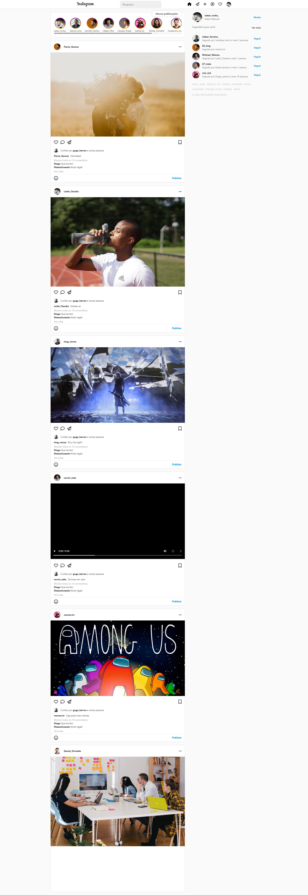

# instagram-clone
Projeto proposto pelo professor Gabriel a fim de trabalhar e memorizar os conceitos e fundamento do react.

O site foi estruturado principalmente com base nos componentes do react, com a ajuda do bootstrap e bastante flexbox

O resultado final da tela ficou assim:

